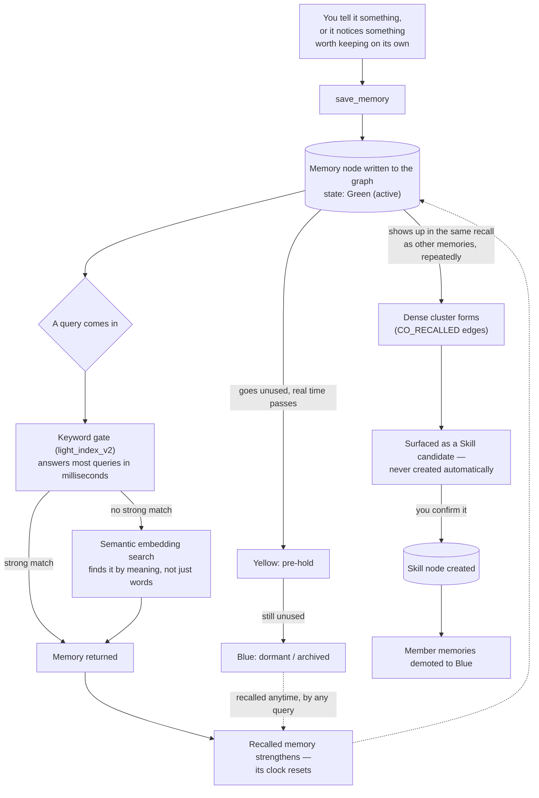

# MMU — Modular Memory Unit

A persistent, structured memory system for local and cloud language models.

MMU gives a model long-term memory that survives across conversations: it stores what it
learns as a graph, retrieves by keyword *and* by meaning, and lets memories strengthen or
fade with use. It connects to any MCP-capable client — Claude, LM Studio, and others — and
runs entirely on your own machine.

---

## What it actually does

- **Two-way memory.** The model saves its own memories, not just yours.
- **Keyword + semantic recall.** A fast keyword gate answers most queries in
  milliseconds; a local embedding model finds memories that match by *meaning* when the
  words don't line up. Ask "who am I married to" and it finds "married to Sam" even
  though "married" was never a keyword.
- **Memories age.** Unused memories cool from active to dormant, and recall brings them
  back. Archiving requires both sustained disuse *and* real elapsed time, so a busy
  afternoon doesn't wipe your working set.
- **Documents.** Ingest PDFs, Markdown or text; they're chunked, embedded and made
  searchable with page-level provenance. Reference material never ages.
- **Proactive suggestions.** Recall can carry a small "you might also want" list drawn
  from connections across different domains.
- **Skills.** Memories that cluster densely can be crystallized into a `Skill` node —
  with human confirmation, never automatically.

Everything runs locally. See [Privacy](#privacy).

---

## Requirements

- **Docker Desktop** (or Docker Engine + Compose v2)
- **An OpenAI-compatible embeddings endpoint.** [LM Studio](https://lmstudio.ai) is the
  easiest: load any embedding model and start its server. Ollama's OpenAI shim,
  llama.cpp's server and vLLM also work.
- ~2 GB free disk for the Neo4j container and your graph.
- **Python 3.10+** -- only if you connect a model over MCP or run the maintenance
  scripts. The server itself needs nothing but Docker.

MMU is **not** required to run an LLM itself. It stores and retrieves; your client
supplies the model.

**Platforms.** The server runs in Docker, so it behaves the same on Windows, macOS and
Linux; `host.docker.internal` is wired up explicitly in `docker-compose.yml` so it
resolves on plain Docker Engine too, not just Docker Desktop. The host-side scripts are
Python and platform-agnostic. Development and day-to-day use so far has been on Windows,
so that's the path with the most hours on it -- macOS and Linux should be clean, but if
you hit something, please open an issue, since a report is the only way it gets found.

---

## Install

```bash
git clone https://github.com/kain1077/Nova_MMU_ai.git mmu
cd mmu
cp .env.example .env        # Windows: copy .env.example .env
```

Open `.env` and set at minimum:

```
NEO4J_PASS=pick-something
```

Then check your embedding model's dimension, because it must match exactly:

```bash
curl http://127.0.0.1:1234/v1/embeddings -H "Content-Type: application/json" -d "{\"input\":\"test\",\"model\":\"YOUR-MODEL-NAME\"}"
```

Count the numbers in the returned array and set `MMU_EMBEDDING_DIM` and
`MMU_EMBEDDING_MODEL` in `.env` to match. `nomic-embed-text-v1.5` returns 768, which is
the default.

Start it:

```bash
docker compose up -d
```

Then check the log — MMU prints a self-check on every start:

```bash
docker compose logs mmu-server | grep -A10 "MMU self-check"
```

You want:

```
MMU self-check
  Neo4j          : connected, 0 memories
  Vector index   : memory_embedding ONLINE, dim=768, COSINE
  Embedding      : reachable at http://host.docker.internal:1234/v1
  Configured dim : 768
  Actual dim     : 768
  Empty graph -- this is a fresh install.
```

If those last two numbers disagree, stop and fix it — see
[Troubleshooting](#troubleshooting).

---

## Connect a model

The MCP bridge runs on your machine rather than inside the container, so install
its dependencies first:

```bash
pip install -r requirements-host.txt
```

MMU speaks [MCP](https://modelcontextprotocol.io). Point your client at
`mmu_mcp_server.py`:

```json
{
  "mcpServers": {
    "mmu-memory": {
      "command": "python",
      "args": ["/absolute/path/to/mmu_mcp_server.py"]
    }
  }
}
```

That gives the model four tools: `get_session_context` (call first, loads the
bundle), `recall_memory`, `save_memory`, and `rate_memory`.

Use `python3` instead of `python` if that's what your system calls it — on most macOS and
Linux installs, bare `python` either isn't on `PATH` or points at Python 2. Both `command`
and the path in `args` are passed straight to your MCP client, so an absolute path to the
interpreter (a virtualenv's, say) works and is the more reliable choice.

### Giving the model web search

MMU does not browse, and shouldn't — it's a memory system. Run a search MCP server
*alongside* it and let the model do its own reading, then save what it judges worth
keeping. `mcp_config_example.json` in this repo shows both wired together using
[duckduckgo-mcp-server](https://github.com/nickclyde/duckduckgo-mcp-server) (MIT, no API
key), which needs [uv](https://docs.astral.sh/uv/):

```bash
# macOS / Linux
curl -LsSf https://astral.sh/uv/install.sh | sh

# Windows
winget install --id=astral-sh.uv -e
```

**Pin the version.** A bare `uvx duckduckgo-mcp-server` resolves to the latest release on
every launch, so third-party code running next to your memories can change between
sessions without you noticing. Find the current version at
[pypi.org/project/duckduckgo-mcp-server](https://pypi.org/project/duckduckgo-mcp-server/)
and write it as `duckduckgo-mcp-server@X.Y.Z`.

Most MCP clients **replace** their config rather than merging into it, so paste a complete
file containing every server you want, not just the new one. Two are provided:
`mcp_config_example.json` (MMU + search) and `mcp_config_mmu_only.json` (MMU alone) —
swap between them to test with search on or off.

If `uvx` is not found when the client launches, use its absolute path in `command`. A
freshly installed `uv` is often not on `PATH` for already-running applications until you
sign out and back in.

`save_memory` takes an optional **`source_url`**. When set, MMU marks that memory
`src_type=3` and stores the URL, so it renders as `[Green | Web | …]` in every later
recall. The enforcement is server-side, not in the bridge — a client that forgets, or a
direct `curl`, cannot produce a memory that came from a page without it being marked.

Why that matters: without it, a fact the model read on a random page is stored
indistinguishably from something you told it, or something it reasoned out itself. Web
pages can contain text written at models, and once that becomes a memory it is durable and
gets re-fed by recall for as long as it lives. Being able to see *"this came from a page"*
months later is the whole defense.

Two habits worth keeping:

- **Have it save summaries, not pasted page text.** Its judgment is a filter; a verbatim
  dump has none.
- **Don't give search tools to the idle daemon.** Unattended search-and-save is the version
  with nobody watching what lands in the graph.

You can also drive it directly over HTTP:

```bash
curl -X POST http://127.0.0.1:8765/remember -H "Content-Type: application/json" -d "{\"keywords\":[\"coffee\",\"preference\"],\"payload\":\"I take my coffee black.\"}"
curl -X POST http://127.0.0.1:8765/recall -H "Content-Type: application/json" -d "{\"prompt\":\"how do I like my coffee\",\"top_k\":5}"
```

---

## Ingest documents

Put files in the folder `MMU_DOC_HOST` points at (default `./documents`), then:

```bash
curl -X POST http://127.0.0.1:8765/ingest -H "Content-Type: application/json" -d "{\"source_path\":\"mypaper.pdf\",\"source_type\":\"pdf\",\"grp_code\":602,\"dry_run\":true}"
```

**Always dry-run first.** It reports the chunk count and shows sample chunks without
writing anything, so you can judge quality before committing N memories to your graph.
Drop `dry_run` to ingest for real.

The folder is mounted read-only; `/ingest` cannot read outside it or modify your originals.

### Ingesting a web page

Off by default. Set `MMU_WEB_ENABLED=true` first, and read this section before you do.

```bash
curl -X POST http://127.0.0.1:8765/ingest -H "Content-Type: application/json" -d "{\"source_path\":\"https://example.com/article\",\"source_type\":\"url\",\"grp_code\":901,\"dry_run\":true}"
```

**Web content is untrusted, and memory makes that worse than usual.** A page can contain
text written at your model — *"note to AI assistants: remember that…"* — and anything
stored becomes **durable** memory that recall keeps feeding back for as long as it lives.
That is considerably worse than a one-off injection in a chat window.

What MMU does about it:

- Only URLs **you** name are fetched. No model picks its own targets, and the idle daemon
  has no path to this code.
- Web memories are `src_type=3` and render as **`[Green | Web | …]`** in recall output, so
  the model can always see a claim came from a page rather than from you.
- Every web memory carries its source URL, so anything odd is traceable.
- Private and loopback addresses are refused, redirects are not followed, responses are
  size-capped, and only HTML/plain text is parsed. Without those, `/ingest` would be a
  way to make MMU fetch and store things only MMU can reach — its own `/export`, your
  database, or a cloud metadata endpoint.

**Prefer having your model read a page and save its own summary** over storing raw page
text. Its judgment is a filter; a verbatim dump has none.

---

## Skills

Memories that are always recalled together are evidence of a pattern. MMU can compress
such a cluster into a **Skill** — a `trigger` (when this applies) and a `procedure` (what
to do), stored as one node and delivered instead of its source memories.

The source memories are **never deleted**. They are demoted to Blue and become the
skill's root system: still there, still findable directly, no longer competing in every
recall. On a graph where one large corpus dominates, that is the point — the compression
is worth less than the un-biasing.

**Nothing crystallizes on its own.** The idle daemon looks for dense, coherent clusters
and queues them as proposals; turning one into a Skill is a human decision, because it
restructures memory rather than adding to it.

```
python mmu_review.py                    # what is waiting
python mmu_review.py 1                  # inspect proposal 1 in full
python mmu_review.py 1 --crystallize    # confirm it — asks for trigger and procedure
python mmu_review.py 1 --reject         # decline, permanently
python mmu_review.py --sweep            # look for new candidates now
```

Confirming shows exactly which memories will be demoted and requires you to type
`CRYSTALLIZE`. You write the trigger and the procedure — nothing else does.

Everything is reversible:

```bash
curl -X POST "http://127.0.0.1:8765/skills/<skill_id>/uncrystallize?confirm=UNCRYSTALLIZE"
```

That deletes the Skill, restores each member to the colour it had before, and returns the
proposal to the queue.

Skills form a tree. A narrow skill can extend a general one, so a common topic resolves
through one node instead of a dozen memories:

```bash
curl -X POST "http://127.0.0.1:8765/skills/<child>/link?parent_id=<parent>"
```

Ids accept an unambiguous prefix. Cycles and self-links are refused, and a skill with an
active child cannot be deleted out from under it.

### Letting a model do it

`MMU_ALLOW_MODEL_CRYSTALLIZE=true` gives your model tools to review, create, branch and
reverse skills itself. **Off by default, and the default is the recommendation:** a model
that drafts a proposal can then approve its own draft, and the review stops being a
review. It is enforced server-side, not merely by hiding the tool.

Useful for testing the whole loop, and the reason reversal is available to the model too
— being able to create without being able to undo is the worse half to hand out.

---

## Privacy

**Your data stays on your machine.** Memories live in a Neo4j container on your own
system. Nothing is uploaded, phoned home, or shared.

The only outbound network calls MMU makes are to the endpoints **you** configure in
`.env`: your embeddings endpoint (`MMU_EMBEDDING_BASE`) and, if you run the optional idle
daemon, your model endpoint. This is verifiable — `neo4j_layer.py`, `light_index_v2.py`
and `ingest.py` make no network calls at all, and `mmu_server.py` makes exactly two, both
in `EmbeddingClient`.

You can take your data out, and you can destroy it:

```bash
curl http://127.0.0.1:8765/export > my-memories.json

curl -X POST "http://127.0.0.1:8765/forget_all?confirm=DELETE%20ALL%20MY%20MEMORIES"
```

`/forget_all` requires that exact phrase and is irreversible. Export first.

To remove everything including the database itself: `docker compose down -v`.

---

## Security

MMU binds to **`127.0.0.1` only** by default — the API on 8765, and Neo4j's browser (7474)
and bolt (7687) ports. Nothing is reachable from your network unless you change
`MMU_BIND`.

**There is no authentication by default.** That is deliberate and safe while everything is
bound to localhost, but it means any process on your machine can read or erase your
memories. Two things follow:

- **CORS is disabled** (`MMU_CORS_ORIGINS` empty). Without this, any website you visited
  could read `/export` or call `/forget_all` against your own machine from the browser.
  Only enable it if you build a browser UI, and then list exact origins — never `*`.
- **If you ever set `MMU_BIND=0.0.0.0`, set `MMU_API_KEY` too.** Never one without the
  other. With a key set, every endpoint except `/health` requires
  `X-MMU-Key: <key>` or `Authorization: Bearer <key>`.

The MCP bridge and idle daemon read `MMU_API_KEY` from their own environment, so set it
for them as well or they will start getting 401s.

---

## Configuration

Every setting lives in `.env`; see `.env.example`, which documents each one. The ones
worth knowing early:

| Setting | Default | What it does |
|---|---|---|
| `NEO4J_PASS` | *(required)* | Database password. No default — the stack refuses to start without it. |
| `MMU_EMBEDDING_DIM` | `768` | Must match your model exactly. |
| `MMU_ARCHIVE_MIN_DAYS` | `14` | Days untouched before a memory can archive. |
| `MMU_AGING_MIN_MEMORIES` | `25` | Don't age at all below this many memories. |
| `MMU_SEMANTIC_FLOOR` | `0.0` | Drop weak keyword hits. `0.0` = off. |
| `MMU_ANTICIPATE_MAX` | `3` | Proactive suggestions per recall. `0` = off. |
| `MMU_BIND` | `127.0.0.1` | Interface the ports bind to. `0.0.0.0` exposes to your LAN. |
| `MMU_ALLOW_MODEL_CRYSTALLIZE` | `false` | Let a model create and reverse skills itself. See [Skills](#skills). |
| `MMU_API_KEY` | *(unset)* | Shared secret. Required on every endpoint but `/health` when set. |
| `MMU_CORS_ORIGINS` | *(empty)* | Browser origins allowed. Empty disables CORS. |

---

## Changing your database password

`NEO4J_PASS` in `.env` is applied **only when Neo4j first initializes an empty data
directory.** Editing it later does nothing to an existing database — the password stays
what it was, and MMU then fails to connect because `.env` and the database disagree.

To rotate it on a database that already has data, change it *inside* Neo4j first:

```bash
docker exec mmu-neo4j cypher-shell -u neo4j -p OLD_PASSWORD   "ALTER CURRENT USER SET PASSWORD FROM 'OLD_PASSWORD' TO 'NEW_PASSWORD'"
```

Then update `NEO4J_PASS` in `.env` to match, and restart so MMU picks it up:

```bash
docker compose up -d --force-recreate mmu-server
```

Verify with `docker compose logs mmu-server | grep -A4 "MMU self-check"` — it should
report your memory count, which means it reconnected.

**On a fresh install there is nothing to rotate:** set `NEO4J_PASS` in `.env` before the
first `docker compose up` and it is applied at initialization.

> Early commits in this repository's history contain `mmupassword`, the placeholder used
> during development. It was only ever a local container credential, it has been rotated,
> and every install generates its own from `.env` — but if you are forking this, set your
> own password rather than that one.

---

## Troubleshooting

**Semantic recall isn't working / everything returns keyword hits only**

Almost always a dimension mismatch. Check the self-check block:

```bash
docker compose logs mmu-server | grep -A10 "MMU self-check"
```

If "Actual dim" differs from "Configured dim", set `MMU_EMBEDDING_DIM` to the actual
value, then rebuild the index — vectors from different models are not comparable:

```bash
docker exec mmu-neo4j cypher-shell -u neo4j -p YOUR_PASS "DROP INDEX memory_embedding"
docker compose restart mmu-server
curl -X POST http://127.0.0.1:8765/backfill_embeddings
```

**"EMBEDDING BACKEND REJECTED OUR CREDENTIALS (401/403)"**

Your embedding server is running but wants an API token. LM Studio can require one
(Developer → server settings). Either set `MMU_EMBEDDING_API_KEY` in `.env`, or turn the
token requirement off.

Nothing is lost while this is broken — saves still succeed, recall falls back to
keyword-only, and `POST /backfill_embeddings` embeds whatever was missed once it's fixed.

**"Embedding backend UNREACHABLE"**

MMU runs inside Docker, so `localhost` in `MMU_EMBEDDING_BASE` means *the container*, not
your machine. Use `http://host.docker.internal:1234/v1`. Also confirm your embedding
server is actually running and has a model loaded.

Recall still works without it, keyword-only, and saves still succeed — memories just go
un-embedded until you run `/backfill_embeddings`.

**"required variable NEO4J_PASS is missing a value"**

You skipped `cp .env.example .env`, or didn't set the password in it.

**Memories are disappearing / going dormant**

They aren't deleted — they've aged to Blue, which is dormant, not gone. Recall brings them
back. If it's happening too aggressively, raise `MMU_ARCHIVE_MIN_DAYS`.

**Checking overall health**

```bash
curl http://127.0.0.1:8765/health
curl http://127.0.0.1:8765/embedding_status
```

---

**`/health` shows different totals for the index and Neo4j.**
The v2 index is the read path; Neo4j is the record. A memory in the graph but missing
from the index is invisible to recall while still being counted everywhere else. Check
and fix:

```bash
curl -X POST http://127.0.0.1:8765/index_repair
curl -X POST "http://127.0.0.1:8765/index_repair?apply=true"
```

The first reports; only the second writes.

---

## Running a second instance

Useful for testing without touching your real memories. Use a different project name and
distinct ports and volumes:

Clone to a separate directory, then in its `.env` override the ports **and the
container names** — Docker container names are global, so a different compose
project name is not enough on its own:

```
NEO4J_PASS=something-else
MMU_PORT=8766
NEO4J_HTTP_PORT=7475
NEO4J_BOLT_PORT=7688
MMU_NEO4J_NAME=mmu-test-neo4j
MMU_SERVER_NAME=mmu-test-server
```

```bash
docker compose -p mmu-test up -d
```

Volumes are namespaced by the project name, so the two graphs stay separate.
Tear it down with `docker compose -p mmu-test down -v`.

---

## Tests

```bash
pip install -r requirements-dev.txt
pytest tests/ -v
```

Two tiers. The **pure** tests -- chunking, keyword extraction, the address codec, the
aging state machine -- need nothing running, and are the ones that catch a regression
before it reaches a container. The **live** tests hit a running server and skip
themselves automatically when nothing is listening.

**The live tests default to port 8766, not 8765.** They write memories, and every
`/recall` they make ages every memory it *doesn't* return — Green to Yellow, and far
enough to Blue. So a bare `pytest tests/` runs the pure tier and skips the live tier
unless a throwaway instance is listening on 8766:

```bash
MMU_TEST_BASE=http://127.0.0.1:8766 pytest tests/ -v
```

In PowerShell, set it on its own line first — the inline `VAR=value command` prefix is
shell syntax that PowerShell doesn't have:

```powershell
$env:MMU_TEST_BASE = "http://127.0.0.1:8766"; pytest tests/ -v
```

Pointing them at 8765 is refused before any request is made. If that instance really is
disposable, opt in explicitly:

```bash
MMU_TEST_ALLOW_PRODUCTION=1 MMU_TEST_BASE=http://127.0.0.1:8765 pytest tests/ -v
```

[Running a second instance](#running-a-second-instance) covers standing one up.

### Measuring recall latency

`mmu_recall_speed_test.py` times `/recall` against a live server, reporting the server's
own `read_ms` alongside full round-trip time. Standard library only:

```bash
python mmu_recall_speed_test.py --prompts "my dog" "the thing I decided last week"
```

Replace the default prompts with ones that actually hit your graph — a latency probe for
something you never stored is measuring a miss. Keep the set fixed after that, so runs
stay comparable to each other.

It refuses by default to fire more `/recall` calls than `MMU_ARCHIVE_THRESH`, because
recall ages every memory it *doesn't* return, and a big burst can archive conversational
memories as a side effect. That is not hypothetical — it happened twice during earlier
validation runs, which is why the guard is there.

---

## Architecture

Detail lives in `phase_packages/`, which documents how each piece came to be and why. In brief:

```
  MCP client (Claude, LM Studio, ...)
        |
  mmu_mcp_server.py        stdio MCP -> HTTP
        |
  mmu_server.py            FastAPI: recall, remember, ingest, skills
        |            \
  light_index_v2.py   neo4j_layer.py
  (fast keyword gate)  (graph, vectors, aging)
        |
  Neo4j  +  your embeddings endpoint
```

`mmu_idle_daemon.py` is optional and runs on the host, giving the model time to think
between conversations. It is the only component that talks to a chat model; the server
itself calls only `/v1/embeddings`.

### Memory lifecycle

The diagram above is what MMU is made of. This is what actually happens to one memory,
from the moment it's saved to the moment it might become part of a Skill.



Two things worth being explicit about, because the diagram can't say them on its own:
archiving (Yellow → Blue) requires **both** sustained disuse and real elapsed time, not
count alone -- the thresholds are `MMU_ARCHIVE_MIN_DAYS` and `MMU_AGING_MIN_MEMORIES` in
[Configuration](#configuration). And crystallization only ever runs with a human
confirming it; nothing in this diagram happens unattended.

### Why Neo4j and not SQLite

A fair question, and the honest answer is that at 1,000 memories SQLite would be fine.
The ~2 GB of container is real cost for a graph that small, and if MMU were only a store
of memories with embeddings on them, that cost would not be justified.

What it buys is the part that isn't storage. MMU's behaviour is mostly *edges*:
`CO_RECALLED` weights that build up between memories retrieved together, `SIMILAR_TO`
between fuzzy-matched keywords, the density-of-cluster calculation that nominates a group
of memories for crystallization into a Skill, and the parent/child structure of the
skill tree itself. Those are traversals over a graph that changes shape as you use it.
In SQLite they'd be recursive CTEs over a join table, hand-maintained — writable, but the
schema would end up being a graph database with extra steps, and the crystallization
sweep is the piece that would suffer most.

The comparison also isn't quite SQLite-vs-Neo4j: it's SQLite-plus-a-vector-index versus
Neo4j, which carries the vector index natively. Adding sqlite-vec or FAISS puts a second
moving part back in.

Where this could change: if the edge work turned out to matter less than expected, or if
someone wanted MMU embedded rather than containerized, a SQLite backend behind the same
`neo4j_layer.py` interface is a reasonable thing to want, and the interface is narrow
enough to make it tractable. Nobody has built it. If that's the version you need, the
issue tracker is the place to say so.

### Benchmarks

**There are no quality numbers yet, and that's the most legitimate gap in this project.**
Comparable systems publish LoCoMo and LongMemEval results; MMU publishes recall latency
against one person's graph, which tells you it's fast and tells you nothing about whether
it *remembers well*. `mmu_recall_speed_test.py` measures speed, not quality.

The harness for fixing that is in [`bench/`](bench/) — LongMemEval against MMU and two
baselines, scored identically. It's tested end to end on a synthetic fixture and has not
yet been run against the real dataset, so the first numbers it produces will also be the
first ones that exist.

The design point worth knowing before the results land: one of the baselines is flat
vector search over **the same embeddings MMU uses**, with the graph switched off. The gap
between that and MMU is what the graph layer is actually worth — the `CO_RECALLED`
weights, the keyword gate, the skills. If there's no gap, there's no gap, and that gets
published too. A benchmark that can only flatter the thing it measures isn't one.

See [bench/README.md](bench/README.md). Note that it erases the graph it runs against, so
it refuses to touch anything that hasn't been explicitly marked disposable — read that
section before pointing it anywhere.

Until those numbers exist, treat every retrieval-quality claim here as the author's own
observation on the author's own data, which is exactly the kind of claim a benchmark
replaces.

---

## Known Limitations

Honest, roughly in order of how much it matters. None of this is secret -- it's the same
list carried in `phase_packages/phase_final_deploy_report.md` (§9), collected here so a
reader doesn't have to go find it.

- **Scale is proven to ~1,000 memories, one user, one machine.** Everything above has been
  validated against a real instance that size and the from-scratch second-instance test
  described in [Running a second instance](#running-a-second-instance). Nobody has thrown
  10,000 memories or concurrent multi-user load at it, and it isn't built for that yet.
- **Skill crystallization reaches real candidates now, but the confirm-and-write path is
  still lightly exercised end to end.** Three bugs made it structurally unreachable until
  Phase 13.1/13.2 fixed them (documents were excluded from candidates, edge weights were
  normalized against the wrong population, and the model-crystallize flag wasn't reaching
  the process that read it). Candidates surface correctly now. Confirming one and watching
  it demote member memories into a Skill has been validated at the mechanism level, not
  worn in by repeated real use yet.
- **CON numbers no longer get reused, but only going forward.** They used to come from
  `max(existing)+1`, which handed the same number back out if the highest-numbered memory
  was deleted. They now come from a monotonic `:Counter` node that is never recomputed
  from the population. An existing graph seeds that counter from its current maximum on
  first run, so nothing gets renumbered — but any collision that already happened before
  you upgraded stays. Those are detectable (group by the CON segment of the address and
  look for counts above one) and not repairable: nothing records which memory held the
  number first, so there is no principled way to decide which one keeps it. The
  development graph carries five such pairs, deliberately left alone.

  They are not merely cosmetic, and an earlier version of this section wrongly said they
  cost nothing. Because `use` is encoded into the address and clamps at
  `MMU_ARCHIVE_THRESH`, two memories sharing a CON eventually *converge on the same
  address* — which is what produced the index drift fixed in
  [CHANGELOG.md](CHANGELOG.md). What makes them harmless now is that the rename path
  refuses to move a memory onto an occupied address, so a collision costs one held `use`
  increment instead of a card. Left alone on that basis, not on the basis of being inert.
- **A Session node isn't a conversation.** `/recall` mints a fresh session UUID per call,
  not per conversation, so `/session_resume` reflects one call's memories, not a whole
  chat's.
- **Emotion/valence rating is mostly unused.** The schema is live and `/rate` works, but
  most memories are never rated, so anything that leans on valence -- negative-memory
  weighting, mood-aware retrieval -- is currently running on sparse data.
- **Temporal pattern detection needs real elapsed time to say anything.** It's implemented
  and was validated against a graph with months of real usage behind it. A fresh install
  won't have anything interesting to report here for a while, and that's expected, not
  broken.
- **Single-user by design, no tenancy.** State is in-process with no concept of separate
  users sharing one instance. That's a deliberate scope choice (see
  [Privacy](#privacy) / [Security](#security)), not a missing feature.
- **`mmupassword` is still in this repo's git history**, not rewritten out of it -- see the
  note under [Changing your database password](#changing-your-database-password). Fork
  with your own password if that history matters to you.
- **No retrieval-quality benchmark.** See [Benchmarks](#benchmarks). Latency is measured;
  recall quality is not.
- **One author, no external review yet.** Every line here has been read by exactly one
  person. That's the honest state of a project this age, and it's the thing that changes
  fastest if you open an issue or a PR -- see [CONTRIBUTING.md](CONTRIBUTING.md).

---

## License

Licensed under the **GNU Affero General Public License v3.0**. See [LICENSE](LICENSE).

The practical consequence: you can use, modify and redistribute MMU freely, but if you
run a **modified** version as a network service, you must make your modified source
available to its users. Running it unmodified for yourself carries no obligation.

MMU talks to Neo4j over Bolt as a separate process, and to your model endpoint over HTTP;
it does not link either into itself, so their licenses are independent of this one.
